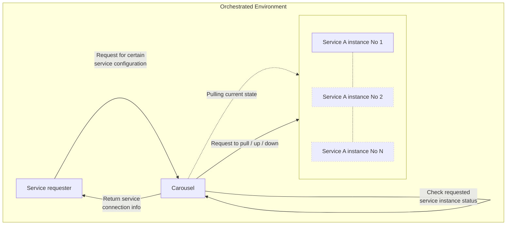

Carousel
===

An open source docker container / kubernetes pod management tool that allowed to spin
new containers / pods, track theirs uniqueness based on a custom set of their arguments,
prevent from doubling, and maintain their life-cycle over time.

> _Project named after carousel tug, vessel that helps bigger ships operate in narrow space._

Concept
---

### How it supposed to work

